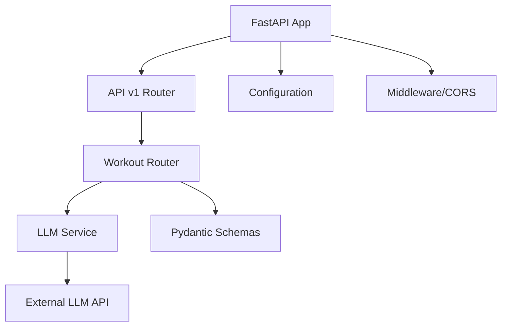

# Fitvise Backend API Documentation

> **Fitness AI-Powered API** for personalized workout plans, nutrition advice, and health guidance

## 📋 Table of Contents

- [Overview](#overview)
- [Architecture](#architecture)
- [API Endpoints](#api-endpoints)
- [Request/Response Models](#requestresponse-models)
- [Error Handling](#error-handling)
- [Usage Examples](#usage-examples)
- [Development Setup](#development-setup)

---

## 🌟 Overview

The Fitvise Backend API provides AI-powered fitness assistance through a RESTful interface. Built with **FastAPI**, it leverages Large Language Models (LLM) to generate personalized fitness advice, workout plans, and health guidance.

### Key Features
- 🤖 **AI-Powered Responses**: LLM-driven fitness advice and workout generation
- 🏗️ **Modular Architecture**: Scalable FastAPI structure with separated concerns
- 🔒 **Type Safety**: Pydantic models for request/response validation
- 📊 **Health Monitoring**: Comprehensive health checks and service monitoring
- 🚀 **High Performance**: Async operations with connection pooling

---

## 🏗️ Architecture

### Directory Structure
```
app/
├── api/v1/
│   ├── endpoints/
│   │   └── workout.py          # Workout-specific endpoints
│   └── router.py               # API v1 router aggregation
├── core/
│   └── config.py              # Application configuration
├── schemas/
│   └── workout.py             # Request/response models
├── services/
│   └── llm_service.py         # LLM integration service
└── main.py                    # FastAPI application entry point
```

### Router Hierarchy
```
FastAPI App (main.py)
    └── API v1 Router (router.py)
        └── Workout Router (workout.py)
            ├── GET /health
            ├── POST /prompt
            └── GET /models
```

### Service Architecture


---

## 🔌 API Endpoints

### Base URL
```
http://localhost:8000/api/v1/workout
```

### Endpoint Overview

| Method | Endpoint | Purpose | Tags |
|--------|----------|---------|------|
| `GET` | `/health` | Service health check | `health` |
| `POST` | `/prompt` | Send fitness prompts to AI | `prompt` |
| `GET` | `/models` | Get available AI models info | `models` |

---

### 🏥 Health Check

#### `GET /health`

**Purpose**: Check the health status of the workout API and LLM service

**Response Model**: `HealthResponse`

**Response Example**:
```json
{
  "status": "healthy",
  "service": "workout-api",
  "version": "1.0.0",
  "llm_service_available": true,
  "timestamp": "2024-01-15T10:30:45.123456Z"
}
```

**Status Values**:
- `"healthy"`: All services operational
- `"degraded"`: LLM service unavailable but API functional
- `"unhealthy"`: Critical service failures

---

### 🤖 Fitness AI Prompt

#### `POST /prompt`

**Purpose**: Send prompts to AI for fitness advice, workout plans, and health guidance

**Request Model**: `WorkoutPromptRequest`

**Response Model**: `WorkoutPromptResponse`

**Request Body**:
```json
{
  "query": "Create a 30-minute upper body workout for beginners",
  "context": "I'm new to fitness, have dumbbells at home, and want to build strength",
  "temperature": 0.7,
  "max_tokens": 500
}
```

**Response Example**:
```json
{
  "response": "Here's a beginner-friendly 30-minute upper body workout using dumbbells:\n\n**Warm-up (5 minutes)**\n- Arm circles: 30 seconds each direction\n- Shoulder shrugs: 1 minute\n...",
  "model": "llama3.2",
  "tokens_used": 347,
  "prompt_tokens": 52,
  "completion_tokens": 295,
  "duration_ms": 1250.5,
  "success": true,
  "error": null
}
```

**Error Responses**:

| Status Code | Description | Example |
|-------------|-------------|---------|
| `400` | Invalid request parameters | Empty query, invalid temperature |
| `503` | LLM service unavailable | Timeout or service errors |
| `500` | Internal server error | Unexpected processing errors |

---

### 📋 Models Information

#### `GET /models`

**Purpose**: Get information about available LLM models and service configuration

**Response Example**:
```json
{
  "current_model": "llama3.2",
  "base_url": "http://localhost:11434",
  "default_temperature": 0.7,
  "default_max_tokens": 1000,
  "timeout_seconds": 30,
  "service": "workout-api",
  "version": "1.0.0"
}
```

---

## 📊 Request/Response Models

### WorkoutPromptRequest

| Field | Type | Required | Description | Example |
|-------|------|----------|-------------|---------|
| `query` | `string` | ✅ | User's fitness-related prompt (1-1000 chars) | `"Create a HIIT workout"` |
| `context` | `string` | ❌ | Additional context (max 2000 chars) | `"I'm a beginner with 20 minutes"` |
| `temperature` | `float` | ❌ | Response creativity (0.0-2.0) | `0.7` |
| `max_tokens` | `integer` | ❌ | Maximum response length (50-2000) | `500` |

### WorkoutPromptResponse

| Field | Type | Description |
|-------|------|-------------|
| `response` | `string` | AI-generated fitness advice or plan |
| `model` | `string` | AI model used for response generation |
| `tokens_used` | `integer?` | Total tokens consumed |
| `prompt_tokens` | `integer?` | Tokens used for input |
| `completion_tokens` | `integer?` | Tokens used for output |
| `duration_ms` | `float?` | Response generation time in milliseconds |
| `success` | `boolean` | Whether prompt processing was successful |
| `error` | `string?` | Error message if processing failed |

### HealthResponse

| Field | Type | Description |
|-------|------|-------------|
| `status` | `string` | Service status (`healthy`/`degraded`/`unhealthy`) |
| `service` | `string` | Service identifier |
| `version` | `string` | API version |
| `llm_service_available` | `boolean` | LLM service availability |
| `timestamp` | `string` | Health check timestamp (ISO format) |

---

## ⚠️ Error Handling

### Error Response Format

All errors follow a consistent structure:

```json
{
  "detail": "Human-readable error message",
  "error": "Error type identifier",
  "code": "ERROR_CODE" // Optional
}
```

### Common Error Scenarios

#### 400 Bad Request
```json
{
  "detail": "Query cannot be empty"
}
```

#### 503 Service Unavailable
```json
{
  "detail": "LLM service is currently unavailable due to timeout"
}
```

#### 500 Internal Server Error
```json
{
  "detail": "An unexpected error occurred while processing fitness prompt"
}
```

---

## 💡 Usage Examples

### cURL Examples

#### 1. Health Check
```bash
curl -X GET 'http://localhost:8000/api/v1/workout/health'
```

#### 2. Fitness AI Prompt
```bash
curl -X POST 'http://localhost:8000/api/v1/workout/prompt' \
  -H 'Content-Type: application/json' \
  -d '{
    "query": "Create a 20-minute HIIT workout for fat loss",
    "context": "I have no equipment and limited space",
    "temperature": 0.7
  }'
```

#### 3. Models Information
```bash
curl -X GET 'http://localhost:8000/api/v1/workout/models'
```

### Python Example

```python
import httpx
import asyncio

async def fitness_prompt_example():
    async with httpx.AsyncClient() as client:
        # Send fitness prompt
        response = await client.post(
            "http://localhost:8000/api/v1/workout/prompt",
            json={
                "query": "Design a beginner strength training routine",
                "context": "3 days per week, home gym with basic equipment",
                "temperature": 0.7,
                "max_tokens": 800
            },
            timeout=30.0
        )
        
        if response.status_code == 200:
            result = response.json()
            print(f"AI Response: {result['response']}")
            print(f"Tokens Used: {result['tokens_used']}")
        else:
            print(f"Error: {response.json()}")

# Run the example
asyncio.run(fitness_prompt_example())
```

### JavaScript/TypeScript Example

```typescript
interface PromptRequest {
  query: string;
  context?: string;
  temperature?: number;
  max_tokens?: number;
}

interface PromptResponse {
  response: string;
  model: string;
  tokens_used?: number;
  duration_ms?: number;
  success: boolean;
  error?: string;
}

async function askFitnessAI(request: PromptRequest): Promise<PromptResponse> {
  const response = await fetch('http://localhost:8000/api/v1/workout/prompt', {
    method: 'POST',
    headers: { 'Content-Type': 'application/json' },
    body: JSON.stringify(request)
  });
  
  return response.json();
}

// Usage
const result = await askFitnessAI({
  query: "What's the best post-workout nutrition?",
  context: "I just finished a 45-minute strength training session",
  temperature: 0.6
});

console.log(result.response);
```

---

## 🚀 Development Setup

### Prerequisites
- Python 3.8+
- FastAPI
- Pydantic
- httpx
- LLM service (e.g., Ollama)

### Installation

1. **Clone and setup**:
```bash
cd fitvise/backend
python -m venv venv
source venv/bin/activate  # On Windows: venv\Scripts\activate
pip install -r requirements.txt
```

2. **Environment Configuration**:
Create `.env` file with:
```env
APP_NAME=Fitvise Backend API
APP_VERSION=1.0.0
APP_DESCRIPTION=AI-powered fitness API

LLM_BASE_URL=http://localhost:11434
LLM_MODEL=llama3.2
LLM_TEMPERATURE=0.7
LLM_MAX_TOKENS=1000
LLM_TIMEOUT=30

API_V1_PREFIX=/api/v1
API_HOST=0.0.0.0
API_PORT=8000
```

3. **Run Development Server**:
```bash
python -m uvicorn app.main:app --reload --host 0.0.0.0 --port 8000
```

4. **API Documentation**:
- **Swagger UI**: http://localhost:8000/docs
- **ReDoc**: http://localhost:8000/redoc

### Testing

Run the example client:
```bash
python api_example.py
```

---

## 🔧 Configuration

### Environment Variables

| Variable | Description | Default | Required |
|----------|-------------|---------|----------|
| `APP_NAME` | Application name | - | ✅ |
| `APP_VERSION` | API version | - | ✅ |
| `LLM_BASE_URL` | LLM service endpoint | - | ✅ |
| `LLM_MODEL` | Model identifier | - | ✅ |
| `LLM_TEMPERATURE` | Default response creativity | `0.7` | ✅ |
| `LLM_MAX_TOKENS` | Default max response length | `1000` | ✅ |
| `LLM_TIMEOUT` | Request timeout (seconds) | `30` | ✅ |
| `API_V1_PREFIX` | API version prefix | `/api/v1` | ✅ |

### CORS Configuration

The API supports configurable CORS for cross-origin requests:
- `CORS_ORIGINS`: Allowed origins (comma-separated)
- `CORS_ALLOW_CREDENTIALS`: Allow credentials
- `CORS_ALLOW_METHODS`: Allowed HTTP methods
- `CORS_ALLOW_HEADERS`: Allowed headers

---

## 📈 Performance & Monitoring

### Health Monitoring
- **Endpoint**: `GET /health`
- **Monitors**: LLM service availability, API responsiveness
- **Status Levels**: healthy, degraded, unhealthy

### Metrics Tracking
- **Token Usage**: Track prompt and completion tokens
- **Response Times**: Monitor generation duration
- **Success Rates**: Track successful vs failed requests
- **Model Performance**: Compare different LLM models

### Logging
- **Structured Logging**: JSON format for production
- **Request Tracing**: Unique request IDs
- **Error Tracking**: Comprehensive error logging
- **Performance Metrics**: Response time tracking

---

## 🔐 Security Considerations

### Input Validation
- **Query Length**: Limited to 1000 characters
- **Context Length**: Limited to 2000 characters
- **Parameter Ranges**: Temperature (0.0-2.0), tokens (50-2000)

### Rate Limiting
Consider implementing rate limiting for production:
- Per-user request limits
- IP-based throttling
- Token usage quotas

### Data Privacy
- No persistent storage of user prompts
- Temporary processing only
- Configurable data retention policies

---

## 🤝 Contributing

### Code Style
- **Type Hints**: All functions must have type annotations
- **Pydantic Models**: Use for all request/response structures
- **Async/Await**: Prefer async operations for I/O
- **Error Handling**: Comprehensive exception handling

### Testing
- **Unit Tests**: Test individual components
- **Integration Tests**: Test API endpoints
- **Load Testing**: Performance validation

---

## 📚 Additional Resources

- **FastAPI Documentation**: https://fastapi.tiangolo.com/
- **Pydantic Documentation**: https://pydantic-docs.helpmanual.io/
- **OpenAPI Specification**: Generated at `/docs` endpoint
- **API Schema**: Available at `/openapi.json`

---

**Built with ❤️ for the Fitvise fitness community**